# ORION 1.0 — 24H National Hackathon Platform
### Microsoft Club SIST • Sathyabama Institute of Science and Technology, Chennai

[](https://nextjs.org/)
[](https://react.dev/)
[](https://www.typescriptlang.org/)
[](https://tailwindcss.com/)
[](https://supabase.com/)
[](https://threejs.org/)
[](https://vercel.com/)
[](LICENSE)

---

## 1. Executive Overview

**ORION 1.0** is a full-stack, aerospace-themed mission portal and registration platform for the nationwide 24-hour hackathon organized by **Microsoft Club SIST** at the **Sathyabama Institute of Science and Technology (SIST)** in Chennai, India.

The platform includes a **6-step registration flow**, a **UPI-based payment verification system** with screenshot proof, a **Supabase PostgreSQL database** (8 tables, service-role-only access), a **team portal** with passcode authentication and self-service passcode reset, a **live registration telemetry count**, and an **organizer Admin Command Center** with real-time sync, evaluation scoring, and CSV export.

* **Prize Pool**: **₹1,00,000** total cash rewards, merit bounties, and incubation grants.
* **Squad Structure**: **2–6 Participants** per squad (1 Team Leader + up to 5 Team Members).
* **Round 1 Entry Fee**: **₹100 FLAT PER TEAM** (single UPI payment transaction).
* **Finalist Fee**: **₹250 Per Head** (Top 70 finalists for the offline round).
* **Online Deadline**: **September 08, 2026**.
* **Offline Finale**: **September 18, 2026** — Top 70 Finalist squads invited to the 24-hour offline hackathon at SIST Chennai.
* **Venue**: Sathyabama Institute of Science and Technology, OMR, Chennai.

### Schedule & Date Changes

All event dates, deadlines, schedules, and timings are subject to change based on organizational requirements or unforeseen circumstances. Any revisions will be officially communicated through the designated ORION 1.0 communication channels. Participants are expected to regularly check for updates and comply with the revised schedule.

---

## 2. Full-Stack Architecture

```mermaid
flowchart TD

subgraph group_public["Public Registration & Landing"]
  node_landing["Landing Page<br/>Next.js client page<br/>[page.tsx]"]
  node_event_data["Event Content<br/>static data<br/>[orionData.ts]"]
  node_register_modal["Registration Modal<br/>6-step wizard<br/>[RegisterModal.tsx]"]
  node_receipt_modal["Payment Receipt<br/>React modal<br/>[PaymentReceiptModal.tsx]"]
  node_challenge_modal["Challenge Detail<br/>problem statement modal<br/>[ChallengeModal.tsx]"]
  node_status_modal["Team Status Lookup<br/>React modal<br/>[TeamStatusModal.tsx]"]
  node_terms_page["Terms & Rules<br/>Next.js page<br/>[/terms]"]
end

subgraph group_3d["3D & Visual Layer"]
  node_space_bg["Space Background<br/>Three.js dynamic import<br/>[SpaceBackground.tsx]"]
  node_constellation["Orion Constellation<br/>Three.js 3D scene<br/>[OrionConstellation3D.tsx]"]
  node_trophy["Trophy 3D<br/>Three.js model<br/>[Trophy3D.tsx]"]
end

subgraph group_sections["Landing Page Sections"]
  node_hero["HeroSection"]
  node_challenges["ChallengeArena"]
  node_prizes["PrizeSection"]
  node_guidelines["GuidelinesSection"]
  node_timeline["TimelineSection"]
  node_organizers["OrganizersSection"]
  node_faq["FAQSection"]
  node_venue["VenuePerksSection"]
  node_footer["Footer"]
end

subgraph group_common["Shared Components"]
  node_navbar["Navbar<br/>responsive navigation"]
  node_clickspark["ClickSpark<br/>cursor particle effects"]
  node_glasscard["GlassCard<br/>glassmorphism container"]
  node_countdown["CountdownTimer"]
  node_scroll_reveal["ScrollReveal<br/>intersection observer"]
  node_gooey_nav["GooeyNav<br/>animated nav"]
  node_web_threads["WebThreads<br/>background animation"]
  node_json_ld["JsonLd<br/>SEO structured data"]
end

subgraph group_server["Server API Routes"]
  node_registration_api["POST /api/registrations<br/>team registration<br/>[route.ts]"]
  node_registration_count["GET /api/registrations/count<br/>live telemetry<br/>[route.ts]"]
  node_status_api["GET /api/status<br/>system health check<br/>[route.ts]"]
  node_team_auth["POST /api/auth/team<br/>portal login<br/>[route.ts]"]
  node_forgot_passcode["POST /api/auth/team/forgot<br/>passcode reset request<br/>[route.ts]"]
  node_reset_passcode["POST /api/auth/team/reset<br/>consume reset token<br/>[route.ts]"]
  node_portal_api["GET /api/team/portal<br/>team data loader<br/>[route.ts]"]
  node_payment_api["POST /api/team/payment<br/>UPI proof submission<br/>[route.ts]"]
  node_submission_api["POST /api/team/submission<br/>PPT/PDF upload<br/>[route.ts]"]
  node_resub_api["POST /api/team/resubmission<br/>re-upload request<br/>[route.ts]"]
  node_admin_config["GET /api/admin/config<br/>admin auth validation<br/>[route.ts]"]
  node_admin_session["POST /api/admin/session<br/>admin session cookie<br/>[route.ts]"]
  node_admin_registrations["POST /api/admin/registrations<br/>admin actions API<br/>[route.ts]"]
end

subgraph group_access["Portal & Admin Pages"]
  node_portal_page["Team Portal<br/>Next.js client page<br/>[/portal]"]
  node_admin_page["Admin Command Center<br/>Next.js client page<br/>[/admin]"]
end

subgraph group_integrations["Persistence & Operations"]
  node_supabase_client["Supabase Server Client<br/>service-role DAL<br/>[supabase.ts]"]
  node_server_store["Server Store<br/>business logic layer<br/>[serverStore.ts]"]
  node_database[("PostgreSQL<br/>8 tables + indexes<br/>[schema.sql]")]
  node_storage{{"Supabase Storage<br/>submissions bucket"}}
  node_email["SMTP Email Service<br/>nodemailer<br/>[email.ts]"]
  node_rate_limit["Rate Limiter<br/>in-memory guard<br/>[rateLimit.ts]"]
  node_admin_auth["Admin Auth<br/>HMAC cookie sessions<br/>[adminAuth.ts]"]
  node_file_validation["File Validation<br/>type & size guard<br/>[fileValidation.ts]"]
  node_passcode_policy["Passcode Policy<br/>reset token rules<br/>[passcodePolicy.ts]"]
  node_payment_proof["Payment Proof<br/>screenshot validation<br/>[paymentProof.ts]"]
  node_storage_lib["Storage Helpers<br/>signed URL minting<br/>[storage.ts]"]
  node_reminder_cron["Payment Reminder Cron<br/>Vercel scheduled<br/>[/api/cron/payment-reminders]"]
end

node_landing -->|"renders"| node_event_data
node_landing -->|"opens"| node_register_modal
node_landing -->|"opens"| node_status_modal
node_landing -->|"opens"| node_challenge_modal
node_landing -->|"reads telemetry"| node_registration_count
node_register_modal -->|"submits team"| node_registration_api
node_register_modal -->|"shows"| node_receipt_modal
node_registration_api -->|"persists"| node_server_store
node_portal_page -->|"authenticates"| node_team_auth
node_portal_page -->|"loads state"| node_portal_api
node_portal_page -->|"submits payment"| node_payment_api
node_portal_page -->|"uploads deck"| node_submission_api
node_portal_page -->|"requests re-upload"| node_resub_api
node_portal_page -->|"forgot passcode"| node_forgot_passcode
node_admin_page -->|"validates session"| node_admin_config
node_admin_page -->|"manages session"| node_admin_session
node_admin_page -->|"all admin actions"| node_admin_registrations
node_server_store -->|"queries"| node_supabase_client
node_supabase_client -->|"reads & writes"| node_database
node_submission_api -->|"uploads files"| node_storage
node_payment_api -->|"uploads screenshots"| node_storage
node_reminder_cron -->|"finds unpaid teams"| node_server_store
node_reminder_cron -->|"sends reminders"| node_email
node_admin_registrations -->|"sends emails"| node_email
node_registration_api -.->|"protected by"| node_rate_limit
node_forgot_passcode -.->|"protected by"| node_rate_limit
node_admin_config -.->|"verified by"| node_admin_auth

classDef toneBlue fill:#dbeafe,stroke:#2563eb,stroke-width:1.5px,color:#172554
classDef toneAmber fill:#fef3c7,stroke:#d97706,stroke-width:1.5px,color:#78350f
classDef toneMint fill:#dcfce7,stroke:#16a34a,stroke-width:1.5px,color:#14532d
classDef toneRose fill:#ffe4e6,stroke:#e11d48,stroke-width:1.5px,color:#881337
classDef toneIndigo fill:#e0e7ff,stroke:#4f46e5,stroke-width:1.5px,color:#312e81
classDef toneTeal fill:#ccfbf1,stroke:#0f766e,stroke-width:1.5px,color:#134e4a
classDef toneSlate fill:#f1f5f9,stroke:#475569,stroke-width:1.5px,color:#1e293b

class node_landing,node_event_data,node_register_modal,node_receipt_modal,node_challenge_modal,node_status_modal,node_terms_page toneBlue
class node_registration_api,node_registration_count,node_status_api,node_team_auth,node_forgot_passcode,node_reset_passcode,node_portal_api,node_payment_api,node_submission_api,node_resub_api,node_admin_config,node_admin_session,node_admin_registrations toneAmber
class node_portal_page,node_admin_page toneMint
class node_supabase_client,node_server_store,node_database,node_storage,node_email,node_rate_limit,node_admin_auth,node_file_validation,node_passcode_policy,node_payment_proof,node_storage_lib,node_reminder_cron toneRose
class node_space_bg,node_constellation,node_trophy toneIndigo
class node_hero,node_challenges,node_prizes,node_guidelines,node_timeline,node_organizers,node_faq,node_venue,node_footer toneTeal
class node_navbar,node_clickspark,node_glasscard,node_countdown,node_scroll_reveal,node_gooey_nav,node_web_threads,node_json_ld toneSlate
```



---

## 3. Project Structure

```
orion-v1/
├── public/
│   ├── ORION_1.0_Template.pptx       # Round 1 PPT template
│   ├── orion_payment_qr.jpg          # UPI QR code for payments
│   ├── logo.png / favicon.*          # Branding assets
│   └── icon.png
├── scripts/
│   ├── verify_bugfixes.ts            # Bugfix verification suite
│   ├── verify_e2e.ts                 # End-to-end flow verification
│   ├── verify_passcode_reset.ts      # Passcode reset flow tests
│   └── verify_security_medium.ts     # Security hardening audit
├── src/
│   ├── app/
│   │   ├── page.tsx                  # Landing page (client)
│   │   ├── layout.tsx                # Root layout (SEO, fonts, meta)
│   │   ├── globals.css               # Global styles (Tailwind v4)
│   │   ├── manifest.ts               # PWA web manifest
│   │   ├── robots.ts                 # robots.txt generator
│   │   ├── sitemap.ts                # XML sitemap generator
│   │   ├── admin/page.tsx            # Organizer Command Center
│   │   ├── portal/page.tsx           # Team Portal (auth-gated)
│   │   ├── terms/page.tsx            # Terms & Conditions
│   │   ├── rules/page.tsx            # Redirects → /terms
│   │   └── api/
│   │       ├── registrations/        # POST register, GET /count
│   │       ├── status/               # GET system health
│   │       ├── auth/team/            # POST login, /forgot, /reset
│   │       ├── team/
│   │       │   ├── portal/           # GET team data
│   │       │   ├── payment/          # POST UPI proof
│   │       │   ├── submission/       # POST deck upload
│   │       │   └── resubmission/     # POST re-upload request
│   │       ├── admin/
│   │       │   ├── config/           # GET admin auth check
│   │       │   ├── session/          # POST login/logout cookie
│   │       │   └── registrations/    # POST all admin actions
│   │       └── cron/
│   │           └── payment-reminders/ # Vercel Cron (daily 09:00 IST)
│   ├── components/
│   │   ├── 3d/                       # Three.js (SpaceBackground, Constellation, Trophy)
│   │   ├── common/                   # Navbar, GlassCard, ClickSpark, CountdownTimer, etc.
│   │   ├── modals/                   # RegisterModal, PaymentReceiptModal, ChallengeModal, TeamStatusModal
│   │   ├── sections/                 # Hero, ChallengeArena, Prize, Guidelines, ImportantRules, Timeline, Organizers, FAQ, Venue, Footer
│   │   └── seo/                      # JsonLd structured data
│   ├── data/orionData.ts             # All event content, prizes, problem statements, FAQ, timeline
│   ├── types/orion.ts                # TypeScript interfaces & enums
│   ├── audio/soundEffects.ts         # UI sound effect helpers
│   ├── db/
│   │   ├── schema.sql                # Full PostgreSQL schema (8 tables)
│   │   ├── reset_entries.sql         # Development data reset script
│   │   └── migrations/              # 16 incremental migrations (001–016)
│   └── lib/
│       ├── supabase.ts               # Supabase service-role client
│       ├── serverStore.ts            # Business logic / data access layer
│       ├── email.ts                  # SMTP transactional email (nodemailer)
│       ├── rateLimit.ts              # In-memory rate limiter
│       ├── adminAuth.ts              # Admin HMAC cookie session
│       ├── storage.ts                # Supabase Storage signed URL helpers
│       ├── fileValidation.ts         # Upload type & size validation
│       ├── passcodePolicy.ts         # Passcode reset token policy
│       ├── paymentProof.ts           # Payment screenshot validation
│       └── teamUsername.ts           # Team username generation
├── vercel.json                       # Vercel Cron schedule config
├── next.config.ts                    # CSP, security headers, HSTS
├── package.json
├── tsconfig.json
└── LICENSE                           # MIT
```

---

## 4. Multi-Step Registration Wizard

The registration system (`RegisterModal.tsx`) features a 6-step flow:

1. **Step 1 — Team Information**:
   - Team Name, Team Leader Name, Leader WhatsApp Phone (`+91` 10-digit validation), Leader Email
   - Institution / College Name, Department, Year
   - Problem Statement dropdown (`ORION-PS-01` to `ORION-PS-04`)
2. **Step 2 — Team Members (1–5 Crew Members)**:
   - Collects Name, Phone, Email, Department, and Year for each member
   - Flexible squad size: 2–6 total participants (leader + 1–5 members)
3. **Step 3 — Declaration & Consent**:
   - 5 mandatory checkboxes: accuracy, membership, rules, fee structure, qualifier terms
4. **Step 4 — Review Before Payment**:
   - Comprehensive review dossier with `[ EDIT DETAILS ]` and `[ PROCEED TO CHECKOUT — ₹100 ]`
5. **Step 5 — UPI Payment & UTR Submission**:
   - Flat **₹100 per team**, paid by UPI: QR code, copyable UPI ID, or a one-tap `upi://` intent on mobile
   - Submission requires all five:
     1. 12-digit **UTR / transaction reference**
     2. **Payer name** as in the bank account
     3. **UPI ID** the fee was paid from
     4. **Receipt screenshot** (image or PDF, ≤ 10 MB)
     5. Confirmation that **team name went into the payment note**
6. **Step 6 — Submitted, Pending Verification**:
   - Registration ID (`ORION-2026-XXXX`) and access passcode issued
   - Organisers verify the payment in the admin console

---

## 5. Database Schema (Supabase PostgreSQL)

The schema (`src/db/schema.sql`) defines **8 relational tables** with Row Level Security enabled on all:

### `public.teams`
| Column | Type | Description |
| :--- | :--- | :--- |
| `id` | `uuid PK` | Unique team row ID |
| `registration_id` | `text UNIQUE` | Standardized ID (`ORION-2026-XXXX`) |
| `team_name` | `text` | Squad name |
| `leader_name` / `leader_phone` / `leader_email` | `text` | Leader contact details |
| `institution` / `department` / `year` | `text` | Academic info |
| `problem_statement` | `text` | Selected track (`ORION-PS-01` to `04`) |
| `access_token` | `text` | Portal access passcode |
| `payment_status` | `text` | `NOT_SUBMITTED` / `PENDING` / `VERIFIED` / `REJECTED` / `RESUBMISSION_REQUIRED` |
| `round_1_status` | `text` | `NOT_STARTED` / `SUBMISSION_OPEN` / `SUBMITTED` / `UNDER_REVIEW` / `SELECTED` / `NOT_SELECTED` |
| `round_2_status` | `text` | `LOCKED` / `ACCESS_GRANTED` / `CONFIRMED_FINALIST` |
| `round_1_score` | `numeric(5,2)` | Evaluation score |
| `evaluation_scores` | `jsonb` | Detailed 5-axis scoring |
| `admin_notes` | `text` | Organiser annotations |

### `public.team_members`
| Column | Type | Description |
| :--- | :--- | :--- |
| `id` | `uuid PK` | Unique member row ID |
| `team_id` | `uuid FK → teams` | Parent team |
| `member_number` | `integer CHECK 1–6` | Position in roster |
| `member_name` / `member_email` / `member_phone` | `text` | Contact details |
| `department` / `year` | `text` | Academic info |

### `public.payments`
| Column | Type | Description |
| :--- | :--- | :--- |
| `team_id` | `uuid FK UNIQUE` | One payment row per team |
| `utr_number` | `text UNIQUE` | UTR / transaction reference |
| `payer_name` / `payer_upi` | `text` | Payer identity |
| `screenshot_url` | `text` | Payment proof image URL |
| `payment_status` | `text` | `PENDING` / `VERIFIED` / `REJECTED` / `RESUBMISSION_REQUIRED` |

### `public.submissions`
| Column | Type | Description |
| :--- | :--- | :--- |
| `team_id` | `uuid FK` | Submitting team |
| `file_url` / `original_filename` / `file_size` / `file_type` | — | Uploaded deck metadata |
| `project_url` / `repo_url` / `demo_url` | `text` | Optional project links |
| `version` | `integer` | Submission version counter |
| `submission_status` | `text` | `SUBMITTED` / `ACCEPTED` / `SUPERSEDED` / `UNDER_REVIEW` / `EVALUATED` |

### `public.resubmission_requests`
Re-upload approval queue with `PENDING` → `APPROVED` → `USED` lifecycle and a partial unique index enforcing one open request per team.

### `public.suspicion_flags`
Duplicate detection flags: `DUPLICATE_EMAIL`, `DUPLICATE_PHONE`, `DUPLICATE_UTR`, `CROSS_TEAM_PARTICIPANT` with severity levels.

### `public.audit_logs`
Timestamped audit trail of all admin actions (verify, reject, evaluate, email, delete).

### `public.system_config`
Key-value store for runtime settings: `registrationOpen`, `allowRound1Resubmission`, `maxFileSizeMb`, `upiId`, fee amounts, deadlines.

### `public.password_resets`
Self-service passcode recovery tokens. Only the SHA-256 hash is stored; single-use enforced by `consumed_at IS NULL` guard.

---

## 5b. Round 1 Presentation Submission & Re-upload Approval

```
Payment VERIFIED by organiser
          │
          ▼
  First PPT upload  ──────────►  status: ACCEPTED   (auto-accepted, no sign-off)
          │
          │  team wants to change it
          ▼
  POST /api/team/resubmission  ──►  request status: PENDING
          │
          ▼
  Organiser reviews in /admin  ──►  APPROVED  ──►  team uploads once
          │                              │              │
          │                              │              ▼
          └──► REJECTED                  │        new deck ACCEPTED
               existing deck stands      │        old deck SUPERSEDED
                                         │        request  USED
                                         ▼
                              a further change needs a NEW request
```

* **First upload is free** once payment is `VERIFIED` — auto-accepted as the jury's evaluation version.
* **Each approval is worth exactly one re-upload.** Spending it flips the request to `USED`.
* **One request in flight per team**, enforced by a partial unique index.
* Approve/reject decisions email the team leader with the organiser's note.

---

## 5c. Database Migrations

Run these once each in the Supabase SQL Editor, in order (each is idempotent):

| Migration | Purpose |
| :--- | :--- |
| `001_resubmission_requests.sql` | Re-upload workflow table + columns |
| `002_lock_down_rls.sql` | Drop public read/write RLS policies |
| `003_private_submissions_bucket.sql` | Make the submissions bucket private |
| `004_password_resets.sql` | Self-service passcode reset table |
| `005_payments_one_per_team.sql` | Unique `payments.team_id` constraint |
| `006_payment_screenshot_column.sql` | Add `payments.screenshot_url` |
| `007_payer_upi_column.sql` | Add `payments.payer_upi` |
| `008_unique_registration_id.sql` | Dedupe + unique `teams.registration_id` |
| `009_align_live_schema.sql` | Align schema with live database drift |
| `010_team_directory_view.sql` | Materialized view for team directory |
| `011_team_members_team_name.sql` | Denormalize team name onto members |
| `012_merge_duplicate_teams.sql` | Merge and deduplicate team records |
| `013_schema_hardening.sql` | Constraint tightening and index optimization |
| `014_verified_list_import.sql` | Bulk-import verified team statuses |
| `015_team_username.sql` | Add `teams.username` for portal URLs |
| `016_credential_roster.sql` | Credential roster view for organiser export |

> **Deploy order matters**: 002/003 are security migrations — deploy application code first, then apply. 005/006/007 must be applied **before** the code that writes those columns deploys. Fresh installs get everything from `schema.sql` and can skip 001, 004–008 (002 and 003 still apply for RLS and storage bucket changes).

---

## 6. Transactional Email Deliverability

All mail goes through one hardened dispatcher in `src/lib/email.ts`:

| Measure | Why |
| :--- | :--- |
| Plain-text alternative on every message | HTML-only mail is the largest controllable spam-score penalty |
| Single pooled, rate-limited transporter | A TCP+TLS+AUTH handshake per message gets the sender throttled |
| Envelope sender pinned to `SMTP_USER` | Keeps SPF/DKIM aligned under DMARC |
| `List-Unsubscribe` + one-click POST | Required by Google and Yahoo bulk sender rules since Feb 2024 |
| Hidden preheader per template | Stops clients scraping boilerplate as the preview line |
| Distinct `Message-ID` / `X-Entity-Ref-ID` | Stops Gmail threading separate notices together |
| Certificate validation enforced | `rejectUnauthorized: false` never helped delivery |
| Subject lines de-spammed | Dropped bracket prefixes and "Action Required" |
| Every send awaited (or handed to `after()`) | Fire-and-forget dies with the serverless invocation |

Verify SMTP credentials without sending anything:
```bash
curl -X POST https://your-host/api/admin/registrations \
  -H "x-admin-key: $ADMIN_SECRET_KEY" \
  -H 'Content-Type: application/json' \
  -d '{"action":"CHECK_MAILER"}'
```

---

## 7. Security Hardening

### HTTP Headers (`next.config.ts`)
* **Content-Security-Policy**: `default-src 'self'`, restrictive `script-src`, `frame-ancestors 'none'`, `object-src 'none'`, `form-action 'self'`
* **Strict-Transport-Security**: 2-year HSTS with `includeSubDomains; preload`
* **X-Frame-Options**: `DENY` (clickjacking protection)
* **Referrer-Policy**: `strict-origin-when-cross-origin`
* **X-Content-Type-Options**: `nosniff`
* **Permissions-Policy**: camera, microphone, geolocation all disabled
* **Uploaded files** at `/uploads/*` get `Content-Disposition: attachment` and `sandbox; default-src 'none'`

### Data Access
* All Supabase queries go through `SUPABASE_SERVICE_ROLE_KEY` (server-only) — the anon key is locked out by migration 002.
* Admin sessions use HMAC-signed `HttpOnly` cookies (`adminAuth.ts`), not raw API key headers.
* Rate limiting on registration and passcode reset endpoints.
* CSV export escapes formula injection (`=`, `+`, `-`, `@`, tab, CR prefixed with `'`).

### Passcode Reset (`/api/auth/team/forgot` → `/api/auth/team/reset`)
* Only the **SHA-256 hash** of the reset token is stored in `password_resets`.
* Token expires after a configurable TTL; single-use enforced at the database level.
* Constant-time responses (using `next/server` `after()`) prevent email enumeration.

---

## 8. Organizer Admin Command Center (`/admin`)

Access the organizer dashboard at `/admin`:

* **Session-Based Auth**: HMAC `HttpOnly` cookie session, validated by `ADMIN_SECRET_KEY`.
* **Telemetry Dashboard**: Total Squads, Payment Verified/Pending/Rejected, Revenue, Re-upload Request queue.
* **Track Breakdown**: Real-time distribution across all 4 problem statements.
* **Search & Filter**: By Registration ID, team name, leader, college; filter by track and payment status.
* **5-Member Squad Drawer**: Expand any team to view leader contacts, all crew members, payment dossier (UTR, payer name, payer UPI, receipt screenshot), submission history.
* **Payment Actions**: Verify, Reject, or Request Resubmission of payment proofs.
* **Evaluation Scoring**: 5-axis scoring (Innovation, Architecture, Impact, Execution, Feasibility) out of 50.
* **Round Management**: Advance teams through Round 1 → Round 2 status progression.
* **Re-upload Request Queue**: Approve or decline PPT replacement requests with a note emailed to the team.
* **Email Actions**: Send registration confirmation, payment reminders, and custom notices.
* **SMTP Health Check**: Verify mailer credentials without sending.
* **Live Auto-Polling**: Auto-syncs incoming registrations every 6 seconds.
* **1-Click CSV Export**: Downloads complete `ORION_1.0_Registrations.csv` with formula-injection protection.
* **Audit Log**: Full history of all admin actions per team.

---

## 9. Team Portal (`/portal`)

Teams access their dashboard at `/portal` with their Registration ID + Access Passcode:

* **Authentication**: Registration ID + passcode, with session persistence in `sessionStorage`.
* **Self-Service Passcode Reset**: "Forgot Passcode?" flow sends a SHA-256-hashed, time-limited reset link to the leader's email.
* **Payment Submission**: Upload UPI payment proof (UTR, payer details, screenshot).
* **Round 1 Deck Upload**: Upload PPT/PDF presentation once payment is verified.
* **Re-upload Requests**: Request permission to replace a submitted deck (organiser approval required).
* **Status Tracking**: Real-time visibility into payment status, round 1 status, and round 2 access.
* **Team Roster**: View all team members and contact details.

---

## 10. Project Setup & Quickstart

### Prerequisites
* **Node.js**: v18.0 or higher
* **npm**: v9.0 or higher

### Installation
```bash
# 1. Clone repository
git clone https://github.com/praveeneyyy/orion-v1.git
cd orion-v1

# 2. Install dependencies
npm install

# 3. Create .env.local file
cp .env.example .env.local
```

### Environment Configuration (`.env.local`)
```env
# ── Supabase PostgreSQL ─────────────────────────────────────────
NEXT_PUBLIC_SUPABASE_URL=https://your-project-id.supabase.co
SUPABASE_SERVICE_ROLE_KEY=your-service-role-key
NEXT_PUBLIC_SUPABASE_ANON_KEY=your-anon-public-key   # Legacy, locked out by migration 002

# ── Admin Passcode for /admin ───────────────────────────────────
ADMIN_SECRET_KEY=replace-with-a-long-random-secret

# ── Cron Authorisation ──────────────────────────────────────────
CRON_SECRET=replace-with-a-long-random-secret         # Min 16 chars

# ── Public Site Origin (used in email links) ────────────────────
NEXT_PUBLIC_SITE_URL=https://msclubsist.in

# ── Official WhatsApp Group Link ────────────────────────────────
NEXT_PUBLIC_WHATSAPP_GROUP_URL=https://chat.whatsapp.com/orion1point0

# ── SMTP / Transactional Email (nodemailer) ─────────────────────
SMTP_HOST=smtp.gmail.com
SMTP_PORT=587
SMTP_SECURE=false
SMTP_USER=your-address@gmail.com
SMTP_PASS=your-app-password
EMAIL_FROM=your-address@gmail.com
EMAIL_FROM_NAME=ORION 1.0 Secretariat
EMAIL_REPLY_TO=your-address@gmail.com
```

### Run Locally
```bash
# Start development server
npm run dev

# Build production bundle
npm run build

# Start production server
npm start

# Lint
npm run lint
```

### Vercel Deployment
The project includes a `vercel.json` configuring a daily cron job for payment reminders (09:00 IST / 03:30 UTC):
```json
{
  "crons": [
    {
      "path": "/api/cron/payment-reminders",
      "schedule": "30 3 * * *"
    }
  ]
}
```

---

## 11. Tech Stack

| Layer | Technologies |
| :--- | :--- |
| **Framework** | Next.js 16.3.1 (App Router) |
| **UI** | React 19.2.8, Tailwind CSS v4 |
| **3D / Visuals** | Three.js 0.185.1, OGL, GSAP |
| **Animation** | Motion (Framer Motion), GSAP, CSS animations |
| **Icons** | Lucide React |
| **Database** | Supabase PostgreSQL (service-role) |
| **Storage** | Supabase Storage (private bucket, signed URLs) |
| **Email** | Nodemailer (SMTP) |
| **Effects** | Canvas Confetti |
| **Language** | TypeScript 5 |
| **Deployment** | Vercel (Next.js, with the payment reminder cron configured in `vercel.json`) |
| **SEO** | JSON-LD, Open Graph, Twitter Cards, Sitemap, Robots, Geo tags |

---

## 12. Problem Statement Tracks

1. **ORION-PS-01: FloatChat** — Multi-Modal Semantic Query Engine & 4D Visualization for ARGO Oceanographic Data
2. **ORION-PS-02: LexVault** — Zero-Knowledge, Blockchain-Powered eVault for Legal & Evidentiary Chains of Custody
3. **ORION-PS-03: SylvaSense** — Automated Tree Enumeration & Aboveground Biomass Estimation from Multi-Spectral & SAR Satellite Imagery
4. **ORION-PS-04: Open Innovation** — Autonomous AI Systems, Web3 Protocols, Cybersecurity & Next-Gen Hardware

---

## 13. License

This project is open-source and licensed under the [MIT License](LICENSE).

Copyright © 2026 Praveen. Organized by **Microsoft Club SIST**, Sathyabama Institute of Science and Technology, Chennai.
